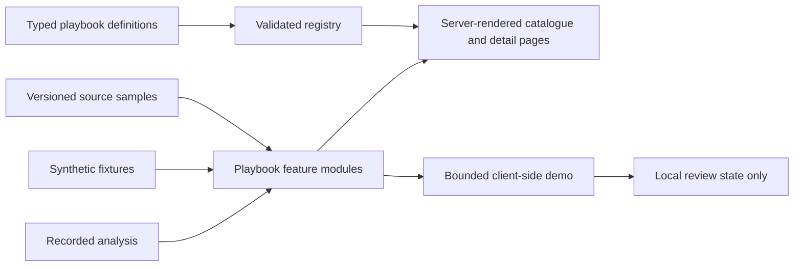

# AI Public-Service Playbooks — Design Source of Truth

## 1. Purpose

This repository is an open-source catalogue of public-service AI playbooks. It helps a broad audience understand a public problem by example, while giving delivery teams a credible technical starting point for further discovery and implementation.

The product must connect four things that are usually separated:

1. the public-service problem and the decision that needs support;
2. the official evidence and realistic data constraints;
3. a bounded, inspectable demonstration;
4. the implementation, evaluation, governance, and contribution path.

The website is a presentation layer for everyone. The repository beneath it is a working reference for technical implementers. Both surfaces tell the same truth at different levels of detail.

The founding source is Northern Ireland's draft Artificial Intelligence Strategy and its proposed public-service use cases. The project is independent, must not imply government endorsement, and must not imitate an official government service.

## 2. Product promise

> Understand the problem. Try a bounded example. Inspect the evidence. Reuse the pattern.

A visitor should be able to answer these questions without reading the code:

- What public-service problem is being addressed?
- Who is affected, and what decision might be supported?
- Why might AI help, and what is the non-AI alternative?
- What official sources inform the example?
- Which data is source material, which is synthetic, and which output is recorded?
- How mature is the evidence?
- What could go wrong, and where does a person retain control?
- What would a real team need to validate next?

A technical contributor should additionally be able to answer:

- Where is the typed playbook definition?
- How were fixtures generated and versioned?
- How does the deterministic baseline work?
- How is recorded AI-assisted output evaluated?
- Which components and domain functions can be reused?
- What tests must pass before a contribution is accepted?

## 3. Audience model

The product serves two audiences through progressive disclosure, not separate products.

### Public and policy audience

Members of the public, policymakers, service leaders, researchers, and subject-matter experts need plain-English explanations, visible evidence, and honest limitations. Their default path ends with understanding and informed scrutiny.

### Delivery and technical audience

Public-sector teams, civic technologists, designers, data practitioners, and software engineers need structured metadata, fixtures, interfaces, evaluation logic, and local run instructions. Their path continues from the same public explanation into implementation details.

Technical detail must be available without making the public explanation feel like documentation. Plain language is the default; implementation detail expands in place or appears later in the page.

## 4. Product principles

### Explain by example

Begin with a recognisable task and a decision, not a model or technology. Examples are small enough to understand and complete enough to inspect.

### Evidence before spectacle

Every demonstration exposes provenance, baseline, evaluation method, maturity, limitations, and known failure modes. Animation or novelty must never outrank comprehension.

### Synthetic but honest

Synthetic data makes examples safe, reproducible, and contribution-friendly. It is never presented as a real case, real person, official dataset, or evidence of operational effectiveness.

### One contract, many domains

Every playbook uses the same core metadata and page order. Domain-specific sections may extend the contract, but they may not hide or rename core evidence and governance fields.

### Public value with human control

Benefits, accountability, contestability, accessibility, and redress are part of the product design. Each playbook must identify the person who remains responsible for the supported decision.

### AI is optional, not assumed

Every interactive exemplar includes a deterministic non-AI baseline. A playbook may conclude that AI is not justified, that better data or service design should come first, or that a safe public demonstration is inappropriate.

## 5. Scope

### MVP

- One Next.js application, one package manifest, and one deployment unit.
- A home page that explains the method and highlights the first exemplar.
- A filterable catalogue of all assessed strategy use cases.
- A consistent detail page for every playbook.
- One complete interactive exemplar: **Policy Evidence Workbench**.
- A method page documenting evidence maturity, synthetic data, evaluation, and contribution rules.
- Versioned, non-sensitive fixtures and recorded outputs that work without credentials or live services.
- Open-source governance and contributor documentation.

### Explicit non-goals

- No live departmental system or production decision support.
- No ingestion pipelines, scheduled jobs, API-key onboarding, or private integrations.
- No runtime calls to an AI model in the hosted MVP.
- No real person-level health, justice, education, housing, employment, benefits, or consultation-response data.
- No claim that a recorded demonstration has been operationally validated.
- No login, personalisation, user accounts, analytics profile, or database in the MVP.
- No attempt to make every catalogue card look equally mature.
- No dark theme in the MVP; forced-colours and operating-system contrast modes remain supported.

## 6. Positioning and research synthesis

Existing patterns establish parts of the answer:

- public-sector algorithm registers explain use and accountability but usually stop before a runnable example;
- interactive model galleries make capabilities tangible but often omit public-service provenance, governance, and reuse guidance;
- open-source government catalogues improve discovery and reuse but are generally registries rather than guided evidence experiences;
- government AI use-case inventories show breadth but often make concepts appear more complete than their evidence permits.

This product's distinctive unit is an **evidence-backed playbook**: a comparable public dossier with an optional bounded demonstration and a reusable implementation path. The interface should feel like an independent research desk, not a procurement catalogue, model leaderboard, or government marketing site.

## 7. Information architecture

### Routes

| Route | Purpose | Primary audience |
| --- | --- | --- |
| `/` | Explain the proposition, evidence chain, first exemplar, and catalogue entry points | Everyone |
| `/playbooks` | Browse and filter all assessed use cases | Everyone |
| `/playbooks/[slug]` | Read one playbook in a fixed, comparable order | Everyone |
| `/playbooks/[slug]/demo` | Use a complete bounded demonstration when maturity permits | Everyone, with technical depth available |
| `/method` | Explain the schema, evidence ladder, synthetic-data policy, evaluation, and contribution process | Public reviewers and contributors |
| `/contribute` | Give focused contribution routes and repository expectations | Contributors |

All routes are part of the same App Router application. Folders, feature modules, and content modules are internal organisation, not separate applications or packages.

### Home page narrative

The home page follows one evidence chain:

1. **Public problem** — why abstract use-case lists are hard to assess or reuse.
2. **Official source sample** — where a realistic example begins.
3. **Synthetic working data** — how safe, repeatable fixtures are derived.
4. **Bounded demonstration** — what the visitor can inspect or try.
5. **Evidence and code** — what is known, what is not, and how to reuse the work.

The primary call to action is **Explore the playbooks**. The exemplar receives a secondary **Try the recorded demonstration** action. Repository links appear after the proposition is understood.

### Catalogue

The catalogue uses dossier rows on desktop and stacked sheets on small screens. It is not a wall of equal marketing cards. Each item exposes enough metadata to compare maturity and feasibility before opening it.

Filters are encoded in the URL so a view can be linked and restored:

- sector;
- technical pattern;
- data accessibility;
- maturity;
- risk level.

Search matches title, plain-English summary, problem, sector, pattern, and tags. Sorting defaults to maturity, then data accessibility, then title. The filter summary is announced to assistive technology.

### Playbook detail sequence

Every playbook page uses this order:

1. At a glance
2. The public-service problem
3. Intended user and supported decision
4. Demonstration or demonstration-readiness assessment
5. Official sources
6. Source sample and synthetic-data method
7. Non-AI baseline
8. Evaluation and evidence maturity
9. Risks, human oversight, contestability, and redress
10. Technical implementation
11. References and contribution path

The order is a governance feature: attractive output may not appear without its data and evidence context nearby.

### Detail-page rendering contract

The eleven-section sequence is also the document order. Each page has one `h1`, one labelled section for every item above, and stable fragment IDs so a source, caveat, or implementation note can be linked directly. The small-screen reading order is the source of truth; the desktop 3/6/3 dossier layout is produced with CSS Grid, not a second copy of the content or breakpoint-driven DOM reordering.

**At a glance** contains maturity, data accessibility, risk, sector, technical patterns, and review status. The summary immediately below the title is the first explanatory prose. The source register and evaluation evidence remain in their numbered sections rather than being promoted into decorative sidebars ahead of the problem statement.

The page renders every state in the content schema:

- `none` explains the evidence, data, or risk barrier and presents the next validation steps;
- `recorded` links to the checked-in demonstration and states its recording date, model label, and limitations;
- `live-local` links to local setup guidance and shows the supplied warning;
- `partner` explains why a controlled integration is required.

The maturity ladder marks the current rung and uses `nextValidationSteps` as the evidence for what remains to reach a more credible state. It must not imply that later rungs have been achieved.

## 8. Catalogue inventory

The initial inventory translates the strategy examples into contribution-sized playbooks. Names are working, plain-English labels rather than claims about deployed systems. Data accessibility and risk are provisional assessments until each source register is researched.

| Slug | Working title | Sector | Initial data view | Initial risk view | MVP state |
| --- | --- | --- | --- | --- | --- |
| `policy-evidence` | Policy Evidence Workbench | Cross-government | Open or public documents | Moderate | Recorded exemplar |
| `diagnostic-imaging-support` | Diagnostic Imaging Support | Health | Restricted | High | Assessed concept |
| `health-operations` | Health Service Demand and Operations | Health | Restricted | High | Assessed concept |
| `lesson-planning-feedback` | Lesson Planning and Feedback Support | Education | Partial | Moderate | Assessed concept |
| `adaptive-tutoring` | Adaptive Tutoring | Education | Restricted | High | Assessed concept |
| `wastewater-monitoring` | Wastewater Monitoring | Environment | Partial | Moderate | Assessed concept |
| `traffic-flow` | Traffic Flow Management | Transport | Open or partial | Moderate | Assessed concept |
| `road-maintenance` | Road Maintenance Planning | Transport | Open or partial | Moderate | Assessed concept |
| `justice-research` | Justice Research and Analysis | Justice | Mixed or restricted | High | Assessed concept |
| `offender-learning` | Learning Support in Custodial Settings | Justice and education | Restricted | High | Assessed concept |
| `violence-risk-research` | Violence Risk Pattern Research | Community safety | Restricted and sensitive | Very high | Assessment only |
| `earth-observation` | Earth Observation for Public Services | Environment | Open | Moderate | Assessed concept |
| `farm-advisory` | Farm Advisory Support | Agriculture | Open or partial | Moderate | Assessed concept |
| `water-management` | Water Resource Management | Infrastructure | Open or partial | Moderate | Assessed concept |
| `community-participation` | Community Participation Analysis | Communities | Open or public submissions | Moderate | Assessed concept |
| `housing-insight` | Housing Need and Service Insight | Housing | Mixed or restricted | High | Assessed concept |
| `life-event-services` | Joined-up Support after a Life Event | Citizen services | Restricted | High | Assessed concept |

`violence-risk-research` is intentionally marked **assessment only**. It must not receive a public interactive demo without independent safeguarding, domain, legal, equality, and affected-community review.

## 9. The playbook contract

### Implementation form

Playbook content is stored as typed TypeScript data and validated with Zod at build and test time. This keeps the repository within one application, gives contributors precise feedback, supports static generation, and avoids adding a content system before one is needed.

Each playbook lives at `content/playbooks/<slug>/playbook.ts`. A central registry imports definitions explicitly, checks unique slugs, and exports public query functions. Fixtures sit below the same playbook directory but are loaded only by that playbook's feature module.

### Required metadata

| Field | Meaning |
| --- | --- |
| `schemaVersion` | Version of the contribution contract |
| `slug`, `title`, `summary` | Stable route key and plain-English identity |
| `sector`, `tags`, `technicalPatterns` | Catalogue classification |
| `problem` | Current service problem, without assuming AI is the answer |
| `intendedUsers` | People who would use or review the intervention |
| `affectedGroups` | People who may experience benefits or harms |
| `supportedDecision` | Decision or task supported; never described as fully automated unless that is explicitly and safely true |
| `publicBenefit` | Intended public value stated without invented metrics |
| `maturity` | Current evidence and implementation state |
| `dataAccessibility` | Realistic access level for necessary data |
| `risk` | Provisional risk tier with reasons |
| `officialSources` | Versioned source register entries |
| `syntheticData` | Method, seed, boundaries, and labelling statement |
| `nonAiBaseline` | Existing or deterministic alternative used for comparison |
| `evaluation` | Questions, metrics, labelled fixture, and result status |
| `humanOversight` | Responsible role, review point, escalation, and redress path |
| `limitations`, `failureModes` | Known gaps and ways the example may mislead or fail |
| `implementation` | Architecture, inputs, outputs, reusable pieces, and partner requirements |
| `references` | Supporting publications and repository material |
| `demo` | Availability and route, or a reason no demo is provided |
| `lastReviewed` | ISO date for content staleness checks |

### Controlled vocabularies

#### Maturity

1. `assessed` — the problem, data reality, risks, and likely implementation pattern are documented; no interactive result is claimed.
2. `recorded-demo` — a bounded interaction uses synthetic fixtures and checked-in recorded output; there is no live model service.
3. `partner-ready` — the playbook has explicit validation protocols and interfaces ready for a data-owning partner. This state is not available in the MVP without partner review.
4. `operational-pilot` — the system has been tested in a controlled real-world setting with governance and monitoring. A repository maintainer cannot self-declare this state.
5. `evaluated-service` — operational outcomes and harms have been independently evaluated. A repository maintainer cannot self-declare this state.

The interface displays the current rung and the missing evidence needed for the next rung. It must not collapse maturity into a percentage.

#### Data accessibility

- `open` — openly accessible under a recorded licence or clear reuse terms;
- `public-readonly` — publicly viewable, but reuse or bulk extraction needs confirmation;
- `partial` — some useful open material exists, while key inputs require a partner;
- `restricted` — necessary data is protected, confidential, licensed, or held in operational systems;
- `unknown` — source research is incomplete.

#### Risk

- `low` — limited consequence and no sensitive population or consequential decision;
- `moderate` — material interpretation or service implications requiring human review;
- `high` — sensitive data, protected groups, or consequential allocation, diagnosis, justice, education, or eligibility contexts;
- `very-high` — foreseeable severe harm, safeguarding implications, or an unacceptable public demo without specialist oversight.

Risk status always includes plain-English reasons and is never communicated by colour alone.

#### Demo availability

- `none` — assessed card and detail page only;
- `recorded` — deterministic fixture plus checked-in recorded AI-assisted output;
- `live-local` — future optional adapter that a developer may run locally with their own service and credentials;
- `partner` — future controlled integration, not exposed publicly.

The MVP may use only `none` and `recorded`.

## 10. Source and synthetic-data contract

### Source register

Every official source entry records:

- stable source ID;
- publisher and jurisdiction;
- title and canonical public URL;
- source type and covered period;
- access date;
- licence or reuse-status statement;
- local sample path, if a small extract is committed;
- SHA-256 hash of the committed sample;
- purpose in the playbook;
- transformations applied;
- caveats and staleness notes.

A source URL alone is insufficient. If reuse terms are unclear, the playbook records that uncertainty and commits only a minimal fact or structure necessary for analysis.

The interface presents sources as an ordered list of semantic source dossiers. Each dossier uses a heading, an external link, and a definition list for publisher, jurisdiction, source type, covered period, access date, reuse status, local sample and hash when present, purpose, transformations, and caveats. Wide layouts may arrange those fields in a compact grid; narrow layouts stack the same elements. Do not maintain separate table and mobile-card markup.

### One-off sourcing approach

The project deliberately does not build production data pipelines. A contributor may make a one-off retrieval from an official public source to understand fields, structure, vocabulary, categories, scale, and realistic constraints. They then commit only a small, permissible source sample and a source-register record.

The example runs against synthetic fixtures, not the source service. This keeps the demo deterministic, reviewable, safe to fork, and independent of keys or changing endpoints.

### Synthetic-data method

Every synthetic dataset must:

1. use a fixed, recorded seed;
2. use invented entity IDs rather than human names, emails, phone numbers, exact addresses, or other person identifiers;
3. derive only defensible structure, categories, distributions, or language characteristics from the recorded source sample;
4. document which characteristics were copied, approximated, deliberately altered, or excluded;
5. include conspicuous `synthetic: true` metadata and a visible label in the interface;
6. be reproducible from a checked-in generator or a documented deterministic transformation;
7. avoid rare combinations that could resemble or disclose a real individual;
8. state that it cannot establish model efficacy, fairness, or production readiness.

The repository keeps source samples, synthetic fixtures, recorded outputs, and evaluation labels in separate directories. Their visual treatment also remains distinct.

### Recorded AI-assisted output

The hosted exemplar does not call a model. A checked-in recorded result includes:

- provider-neutral model label and model/version identifier used at recording time;
- record date;
- prompt or procedure version;
- hashes of the exact input fixture and prompt;
- structured output;
- citations back to fixture excerpts;
- human review dispositions;
- known failures and evaluation result;
- a prominent statement that this is a recorded demonstration, not a live service.

Secrets, credentials, private endpoints, full request logs, and personal operator identity are never recorded.

## 11. Policy Evidence Workbench

### Scenario

A policy team has a public source document and a small corpus of consultation-style responses. It needs to identify recurring themes, inspect supporting excerpts, compare a simple baseline with AI-assisted analysis, and decide which findings deserve further human investigation.

The workbench supports research and synthesis. It does not decide policy, calculate public support, or claim that frequency equals importance.

### Hosted flow

1. **Orient** — read the task, maturity, limitations, and the recorded-demo label.
2. **Inspect source** — view a small official public-document excerpt and its source-register entry.
3. **Inspect synthetic corpus** — see how source-informed consultation responses were generated and labelled.
4. **Run the baseline** — apply deterministic keyword and phrase grouping to the same corpus.
5. **Open recorded analysis** — explore a previously generated, structured AI-assisted thematic analysis.
6. **Follow an evidence thread** — move from finding to citation, source excerpt, synthetic-data note, evaluation item, and human disposition.
7. **Review findings** — accept for further investigation, reject as unsupported, or flag for subject-matter review. State remains local to the browser and resets on refresh.
8. **Compare** — inspect precision-oriented evaluation against a small labelled set and compare the recorded analysis with the baseline.
9. **Reuse** — open the domain interfaces, fixtures, tests, and local-run guidance.

### Core domain objects

- `CorpusDocument` — synthetic response ID, text, tags, and disclosure label;
- `SourceExcerpt` — official sample reference, location, text, and source ID;
- `Finding` — label, summary, confidence wording, evidence references, and limitations;
- `Citation` — exact link from a finding to a corpus excerpt;
- `AnalysisResult` — analysis metadata and findings;
- `EvaluationCase` — labelled expectation and rationale;
- `EvaluationResult` — metric values, per-case outcomes, and caveats;
- `ReviewDisposition` — `unreviewed`, `investigate`, `unsupported`, or `specialist-review`.

### Non-AI baseline

The baseline is deterministic and transparent. It tokenises a controlled vocabulary of themes, scores exact and phrase matches, records the matched excerpts, and applies stable tie-breaking. It provides a meaningful comparison, not a deliberately weak straw person.

### Evaluation

The MVP evaluates evidence retrieval rather than the subjective quality of prose. For a small labelled fixture it reports:

- citation precision;
- evidence coverage or recall;
- unsupported-finding count;
- finding-to-evidence link integrity;
- difference from the deterministic baseline.

Metrics include denominators, case-level results, and limitations. A small synthetic evaluation is a software and interaction check, not proof of policy quality or social value.

### Human control

The interface makes review a first-class action. Findings begin unreviewed. A reviewer may mark them for investigation, unsupported, or specialist review. No state implies final approval or policy adoption. The page explains that a real workflow would require records management, authorisation, equality assessment, subject-matter review, and a defined route for challenge or correction.

## 12. Technical architecture

### Runtime boundary

The MVP is static-first. Content, source manifests, synthetic fixtures, and recorded outputs are imported at build time. Server Components render public pages by default. Client Components are limited to catalogue filters, evidence-thread selection, tabs or disclosure controls, and local review state.

There is no database, authentication layer, background worker, or public API route in the MVP.



### Target repository shape

```text
app/
  layout.tsx
  page.tsx
  not-found.tsx
  method/page.tsx
  contribute/page.tsx
  playbooks/
    page.tsx
    [slug]/
      page.tsx
      demo/page.tsx
components/
  ui/
  site/
content/
  playbooks/
    <slug>/playbook.ts
    policy-evidence/
      fixtures/
        source/
        synthetic/
        recorded/
        evaluation/
features/
  playbooks/
    catalogue/
    detail/
  policy-evidence/
    components/
    domain/
lib/
  playbooks/
    schema.ts
    define-playbook.ts
    registry.ts
tests/
  smoke.test.ts
```

### Dependency direction

- `app` composes routes and metadata; it does not contain domain rules.
- `components/ui` contains shadcn-generated primitives; it is not edited into domain components.
- `components/site` contains small site-wide presentation components.
- `content` imports the playbook schema but no React component.
- `features/playbooks` reads the public playbook registry.
- `features/policy-evidence/domain` is framework-agnostic and has no React or Next.js imports.
- `features/policy-evidence/components` consumes domain results and fixtures.
- No feature imports from `app`.

### Static routes

`generateStaticParams` returns every registry slug for `/playbooks/[slug]`. `dynamicParams = false` makes unknown playbook paths a 404. The demo route uses the same set but renders an unavailable explanation unless `demo.availability === "recorded"`; direct access never produces a broken workbench.

`generateMetadata` reads the same registry entry as the page. Metadata remains server-only and does not duplicate content literals.

## 13. Visual direction: Evidence Desk

### Character

The interface is a contemporary public-interest research desk: calm, exact, independent, and generous with evidence. It uses dossier rows, source notes, document annotations, and visible provenance. It should feel designed, but never promotional or officially endorsed.

### Avoided visual language

- government crests, seals, flag treatments, or cloned official-service headers;
- purple gradients, glowing orbs, glass panels, and generic "AI" imagery;
- chatbot-first heroes;
- equal, floating icon-card grids for unlike use cases;
- decorative monospace text;
- unlabelled confidence scores or traffic-light-only status;
- ambient motion and staggered page entrances.

### Colour

Light mode is the designed MVP experience.

| Token | Value | Use |
| --- | --- | --- |
| `--canvas` | `#F3F5F2` | Page background |
| `--surface` | `#FFFFFF` | Dossiers, tables, and working surfaces |
| `--ink` | `#17212B` | Primary text |
| `--muted-ink` | `#56616B` | Secondary text |
| `--line` | `#C6CDD1` | Structural borders |
| `--line-strong` | `#7B8790` | Active rules and table emphasis |
| `--evidence` | `#006B6B` | Primary action and evidence links |
| `--evidence-hover` | `#005555` | Hover and pressed evidence state |
| `--annotation` | `#F4D35E` | Selected excerpt and note marker |
| `--annotation-ink` | `#332A00` | Text on annotation |
| `--success` | `#147D64` | Supported or completed state |
| `--warning` | `#8A5200` | Caveat and review-needed state |
| `--danger` | `#B42318` | Unsupported or severe-risk state |
| `--focus` | `#006B6B` | Focus ring with canvas offset |

Colour is paired with text, icon, border pattern, or state label. Contrast is tested against WCAG 2.2 AA. Forced-colours mode receives explicit focus, selected, and border rules.

### Typography

- **Archivo Variable** for headings, labels, navigation, and body text.
- **Fragment Mono** only for identifiers, file names, hashes, dates, measurements, and code.
- Body copy: `1rem` to `1.125rem`, line-height `1.6`, maximum measure `65–72ch`.
- Technical text: never below `0.875rem`, with tabular numbers where values are compared.
- Headings use weight and spacing before size. Page titles should not exceed roughly `clamp(2.25rem, 5vw, 4.75rem)`.
- Uppercase is limited to compact metadata labels with increased tracking; sentences remain sentence case.

The implementation uses `next/font/google` for deterministic font loading and exposes both fonts through CSS variables. System fallbacks preserve legibility if a font cannot load.

### Layout and spacing

- 12-column desktop grid, 6-column tablet grid, 4-column mobile grid.
- Maximum content width: `90rem`; long-form measure remains narrower.
- Standard desktop detail layout: 3-column metadata rail, 6-column narrative, 3-column evidence notes. Visual placement never changes the semantic section order.
- Mobile order: title, summary, and status followed by the fixed eleven-section playbook sequence. Metadata and evidence remain inside their corresponding sections.
- Spacing uses a 4px base with principal steps of `4, 8, 12, 16, 24, 32, 48, 64, 96px`.
- Corners are modest: `4px` for evidence markers, `8px` for controls and sheets, `12px` maximum for large working surfaces.
- Shadows are rare and indicate an active layer; structure normally comes from background, rules, and spacing.
- Borders remain visible enough to preserve tables and groupings in print and high contrast.

### Components

Use shadcn/ui through its CLI and preserve the generated primitive boundary. The planned primitives are Button, Badge, Card, Tabs, Table, Select, Command, Alert, Collapsible, Separator, Skeleton, and Tooltip.

Project-specific components include:

- `SiteHeader` and `SiteFooter`;
- `EvidenceChain`;
- `PlaybookDossierRow`;
- `FilterBar` and `FilterSummary`;
- `StatusBadge` and `RiskBadge`;
- `MetadataRail`;
- `SourceRegister`;
- `MaturityLadder`;
- `RecordedDemoBanner`;
- `EvidenceThread`;
- `BaselineComparison`;
- `FindingReviewControls`;
- `ImplementationIndex`.

Component names describe meaning, not visual appearance.

### Signature interaction: evidence thread

Selecting a finding reveals a connected evidence thread:

```text
Finding → citation → corpus excerpt → synthetic-data note → evaluation case → human disposition
```

The active finding uses a left rule and background shift rather than elevation. Connected evidence markers share an identifier and shape. On desktop the evidence panel remains visible beside the finding list; on mobile it follows the active finding in document order. The URL may store the selected finding ID, but review state stays local and ephemeral.

### Motion

- immediate feedback: approximately `120ms`;
- filters and state transitions: `180–220ms`;
- evidence-panel transition: no more than `320ms`;
- easing: restrained ease-out for entry, ease-in-out for layout changes;
- no ambient motion, parallax, looping decoration, or staggered page-load reveal;
- `prefers-reduced-motion` removes translation and makes evidence changes immediate.

### Responsive behaviour

The design is content-first at all widths.

- Catalogue filter controls collapse into an explicit labelled disclosure, while current filters remain visible as removable text controls.
- Wide comparison tables become labelled stacked records, not horizontally clipped miniature tables.
- The metadata rail becomes a definition list after the narrative on mobile.
- The evidence thread preserves source-before-judgement reading order in the DOM.
- Touch targets are at least 44 by 44 CSS pixels.

## 14. Content design

### Voice

Use clear, direct, specific language. Prefer:

- "recorded demonstration";
- "synthetic dataset";
- "not operationally validated";
- "partner data required";
- "supports review";
- "evidence not found in this fixture".

Avoid:

- "AI-powered" as a substitute for describing a function;
- "revolutionary", "transformative", "seamless", or "game-changing";
- implying a model understands, decides, or guarantees;
- invented users, testimonials, adoption, accuracy, savings, or public outcomes;
- unexplained acronyms and model jargon.

### Labels

Provenance labels are literal and persistent:

- **Official source sample**
- **Synthetic working data**
- **Recorded AI-assisted output**
- **Deterministic non-AI baseline**
- **Human review state**

These terms appear in navigation, legends, downloadable filenames, and accessible names where relevant.

### Dates and staleness

Display source access date and playbook review date in human-readable form while keeping ISO dates in metadata. Treat `lastReviewed` as a UTC calendar date. A playbook remains current through its twelve-month anniversary and displays **Review needed** only after that date; anniversary calculation clamps leap-day reviews to the final valid day of February. The status includes the exact recorded review date and never implies that an external source was checked live.

## 15. States and failure handling

### Catalogue

- No results: restate active filters and offer a single **Clear all filters** action.
- JavaScript unavailable: render the full catalogue server-side and provide links for principal filter views; search enhancement may be unavailable.
- Invalid query value: ignore it, retain valid values, and do not throw.

### Playbook

- Unknown slug: use a designed 404 with a catalogue link.
- Missing or invalid definition: fail validation in tests and the production build rather than rendering partial evidence.
- Stale source: show the recorded access date and caveat; do not imply a live check.
- Unavailable external source: keep the source record and local permitted sample; label the link as last verified on the access date.

### Demonstration

- No demo: explain the data, risk, or evidence barrier and link to the readiness assessment.
- Recorded fixture mismatch: fail a hash-integrity test and refuse to label the result as verified.
- Empty evaluation set: render "Evaluation not available" rather than a zero score.
- Broken finding reference: fail validation before build.
- Client JavaScript unavailable: retain the scenario, source, synthetic method, recorded findings, and evaluation as readable server content; interactive review controls may be absent.
- Reset: clearly state that browser-only review state will be discarded, then reset without a page reload.

### Loading

Playbook detail content is local, validated, and rendered at build time, so the detail route has no `loading.tsx` boundary or dossier skeleton. Add a loading treatment only if a future client transition performs genuine asynchronous work, and never replace the core explanation with a loading state.

## 16. Accessibility and inclusion

WCAG 2.2 AA is the minimum acceptance standard.

- A skip link reaches the main content.
- Landmarks and heading levels reflect the document structure.
- Catalogue rows remain links with descriptive accessible names.
- Filters have persistent labels, keyboard support, and announced result counts.
- Tabs follow expected keyboard behaviour; content that matters is not hidden only behind hover.
- Evidence relationships use text IDs and semantic descriptions, not connector lines alone.
- Source excerpts use semantic quotations with citation context.
- Review controls expose selected state and do not use colour alone.
- Focus is visible on every interactive element and is not obscured by sticky content.
- Reduced motion and forced colours are explicitly tested.
- At 200% zoom and 320 CSS pixels width, no core content or action is lost.
- Plain-English summaries precede technical language.
- Print styles preserve source identifiers, URLs, and provenance labels.

## 17. Privacy, security, and integrity

- Commit no secrets, credentials, private endpoints, personal names, personal machine paths, or sensitive person-level records.
- Treat all real consultation responses as potentially personal data unless an official, licensed, safely aggregate sample proves otherwise.
- Synthetic fixtures must not contain realistic contact details or exact residential locations.
- Render fixture text as text, never raw HTML.
- Do not accept arbitrary file upload or prompt input in the hosted MVP.
- External links use safe rel attributes when opening a new context.
- Dependency updates and source-fixture changes receive review like application code.
- Fixture hashes protect provenance integrity; they are not a security guarantee.
- A `SECURITY.md` gives a private reporting route without listing an individual's contact details.

## 18. Testing and quality gates

### Unit and schema tests

- Every playbook parses against the current schema.
- Slugs, source IDs, fixture IDs, and finding IDs are unique.
- Demo routes and recorded outputs reference existing playbooks and fixtures.
- Source sample and prompt hashes match recorded metadata.
- Synthetic generation is deterministic for the recorded seed.
- The baseline is deterministic and returns cited evidence.
- Evaluation handles zero denominators explicitly.
- Catalogue filters are pure, composable, and URL-safe.

### Component tests

- Labels, provenance, maturity, and risk reasons remain visible.
- Evidence selection and review dispositions work by keyboard.
- Reset behaviour is explicit.
- Empty and unavailable states provide a next action.

### Accessibility linting and manual route review

- The existing `eslint-config-next/core-web-vitals` configuration supplies `eslint-plugin-jsx-a11y` and fails CI on the configured static accessibility rules.
- Each route has a unique, descriptive title so the built-in Next.js route announcer has a useful name.
- Before release, manually browse from home to catalogue to a playbook, exercise combined filters, and follow a complete evidence thread.
- Manually compare baseline and recorded output, review and reset a finding, confirm no-demo explanations, and confirm unknown slugs return the designed 404.
- Manually inspect the core routes with JavaScript disabled and with keyboard-only navigation, 200% zoom, reduced motion, and forced colours.
- Browser automation is intentionally outside the MVP test strategy; these checks are recorded in the pull request or release review.

### Build gates

The merge gate is content validation, typecheck, ESLint (including `eslint-plugin-jsx-a11y`), unit and focused component tests, and a production build. Manual route, keyboard, no-JavaScript, zoom, reduced-motion, forced-colours, and screen-reader-oriented inspection complete the release gate.

## 19. Open-source contribution model

A contribution may improve an assessed playbook without building a demo. The smallest valid contribution is a schema-valid playbook with a credible problem statement, source register, data-access assessment, non-AI baseline proposal, risks, and next validation questions.

A recorded demonstration additionally requires:

- a permissible source sample or a clear reason no sample is committed;
- deterministic synthetic fixtures and method documentation;
- a meaningful non-AI baseline;
- recorded output with input and prompt hashes;
- a labelled evaluation fixture;
- human oversight and failure modes;
- unit and focused component coverage, plus a recorded manual route and accessibility review.

The repository uses the Apache License 2.0 for original code and documentation. Third-party source material retains its original licence and is recorded per source. Contributors must not assume that a public webpage permits redistribution.

## 20. Design decisions

| Decision | Why | Revisit when |
| --- | --- | --- |
| One Next.js application | The catalogue, detail pages, and demos share navigation, schema, components, and deployment needs | A demonstrated scaling or ownership boundary exists |
| Typed TypeScript content plus Zod | Strong contribution feedback and static generation without a CMS or extra build pipeline | Non-technical contribution volume makes a separate authoring layer necessary |
| One complete exemplar | Proves the full contract without spreading effort across shallow demos | Policy Evidence Workbench passes the complete quality gate |
| Recorded output, no hosted model calls | Reproducible, inspectable, safe, inexpensive, and key-free | A separately reviewed live adapter has a clear public benefit and abuse model |
| One-off official samples plus synthetic fixtures | Avoids brittle pipelines and sensitive data while preserving realism | A data-owning partner sponsors a controlled integration |
| Deterministic non-AI baseline | Makes the value and limits of AI contestable | Never remove; improve when domain practice offers a better baseline |
| Evidence Desk visual language | Signals scrutiny and provenance without pretending to be an official service | User research shows the metaphor obstructs comprehension |
| Light mode first | Concentrates design and accessibility effort on one finished theme | Core routes pass accessibility and content-quality gates |
| URL-backed catalogue filters | Makes research views shareable and resilient | Never remove without an equally linkable alternative |

## 21. Definition of done for the MVP

The MVP is complete when:

- all seventeen catalogue entries validate and render with honest maturity and data-access labels;
- Policy Evidence Workbench completes the full source-to-review evidence thread without a network service or credential;
- every official source, synthetic fixture, recorded result, and evaluation item is visibly distinct and internally linked;
- a non-specialist can explain the exemplar's purpose and limitations after using the page;
- a technical contributor can locate the schema, generator, baseline, evaluation, and tests without reverse engineering the app;
- the site remains understandable without client JavaScript;
- the quality gate passes in a clean checkout;
- repository history and tracked files contain no personal names, personal local paths, secrets, or sensitive records.
