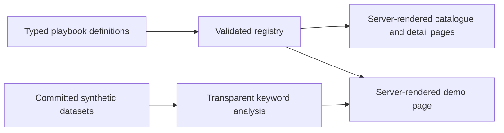

# AI Public-Service Playbooks — Design Source of Truth

## 1. Purpose

This repository is an open-source starting point for anyone who wants to engage with Northern Ireland's draft Artificial Intelligence Strategy — particularly the example public-service projects the draft calls out. Those examples are this site's playbooks.

Every playbook answers four questions in the same order:

1. **A — what the strategy draft proposed** for this service, in plain English, with a link to the draft.
2. **B — which real data sources were investigated** as appropriate to that example: who publishes them, what they cover, how open they are, and why they fit.
3. **C — what synthetic dataset stands in for that data**, so anyone can try the idea with no API key, no account, and no data-sharing agreement — or, where a stand-in would not be responsible, why not and what a contributor would need instead.
4. **D — what a demo shows**, where one has been built, or plainly that none has.

Each playbook closes with one short caveats block.

The website is a presentation layer for everyone. The repository beneath it is a working reference for people who want to fork it. Both surfaces tell the same truth at different levels of detail.

The project is independent. It must not imply government endorsement and must not imitate an official government service.

## 2. Product promise

> See what the draft proposed. See what data exists. Take the dataset. Try the idea.

A visitor should be able to answer four questions about any playbook without reading the code:

- What did the draft strategy propose for this service?
- What real data exists behind it, and how open is it?
- What is the synthetic dataset, and what can it never prove?
- What does the demo do — and what does it not show? (Or: is there a demo at all?)

A technical contributor should additionally be able to answer:

- Where is the typed playbook definition and the schema it must satisfy?
- Where is the dataset file, and what makes it valid?
- How does the demo compute its result, without a model or a key?
- What must pass before a contribution is accepted?

## 3. Audience model

The product serves two audiences through progressive disclosure, not separate products.

### Public and policy audience

Members of the public, policymakers, service leaders, researchers, and subject-matter experts need plain-English explanations, real source links, and honest limits. Their default path ends with understanding and informed scrutiny.

### Delivery and technical audience

Public-sector teams, civic technologists, designers, data practitioners, and software engineers need the typed definition, the dataset, the analysis code, and local run instructions. Their path continues from the same public explanation into the repository.

Technical detail must be available without making the public explanation feel like documentation. Plain language is the default; file paths, schema names, and method notes sit inside the section they belong to.

## 4. Product principles

### Answer the four questions

Every playbook says what the draft proposed, what data exists, what the synthetic dataset is, and what a demo does. Nothing else competes with those four answers for space.

### Say what is missing

An unbuilt demo, an absent dataset, or a restricted source is stated in words. A gap is never implied by an empty space, a hopeful label, or a section quietly left out.

### Synthetic but honest

Synthetic data makes an idea safe, free, and reproducible to try. It is never presented as a real case, a real person, an official dataset, or evidence of operational effectiveness.

### No key, no account, no agreement

Anyone can validate an idea from a clean checkout. That is the point of C, and it is why no hosted page calls a model.

### One contract, many domains

Every playbook uses the same schema and the same five page sections. A domain may say different things in them; it may not rename, reorder, or omit them.

## 5. Scope

### MVP

- One Next.js application, one package manifest, and one deployment unit.
- A home page that explains the draft, the A/B/C/D structure, and the one demo.
- A catalogue of all seventeen playbooks with search and sector filtering.
- A detail page for every playbook with the same five sections in the same order.
- A, B, and C for all seventeen playbooks — with an honest `not-responsible` answer to C where a synthetic stand-in would be irresponsible.
- Exactly one D: the Policy Evidence Workbench demo.
- A "How this works" page covering the four sections, how datasets are made and labelled, and what a demo can never show.
- Committed, non-sensitive datasets that work with no credentials and no live service.
- Open-source release surface: licence, contributing, security, and CI running the quality gate.

### Explicit non-goals

- No live departmental system or production decision support.
- No ingestion pipelines, scheduled jobs, API-key onboarding, or private integrations.
- No calls to an AI model from any hosted page, at build time or at request time.
- No real person-level health, justice, education, housing, employment, benefits, or consultation-response data.
- No accuracy, fairness, or benchmark metrics, and no labelled answer keys: this project measures nothing about model quality.
- No recorded or live AI output presented as a result on a page.
- No governance apparatus layered over the four sections — no rung ladders, no risk tiers, no review workflows, no per-playbook sign-off fields.
- No login, personalisation, user accounts, analytics profile, or database.
- No attempt to make every catalogue row look equally complete.
- No dark theme in the MVP; forced-colours and operating-system contrast modes remain supported.

## 6. Positioning and research synthesis

Existing patterns establish parts of the answer:

- public-sector algorithm registers explain use and accountability but usually stop before anything runnable;
- interactive model galleries make capabilities tangible but often omit the public-service context and the real sources;
- open-source government catalogues improve discovery and reuse but are generally registries rather than guided explanations;
- government AI use-case inventories show breadth but often make concepts appear more settled than their data reality permits.

This product's distinctive unit is a **playbook**: one strategy-draft example, the real sources behind it, a dataset anyone can take, and — where one exists — a demo whose method is readable. The interface should feel like an independent research desk, not a procurement catalogue, model leaderboard, or government marketing site.

## 7. Information architecture

### Routes

| Route | Purpose | Primary audience |
| --- | --- | --- |
| `/` | Explain the draft, the A/B/C/D structure, the one demo, and the catalogue entry point | Everyone |
| `/playbooks` | Browse, search, and filter all playbooks | Everyone |
| `/playbooks/[slug]` | Read one playbook in the same five-section order | Everyone |
| `/playbooks/[slug]/demo` | Use the demo, or read why there is not one yet | Everyone |
| `/method` | "How this works": the four sections, how datasets are made, what a demo cannot show | Public reviewers and contributors |
| `/contribute` | Four contribution tracks and repository expectations | Contributors |

All routes are part of the same App Router application. Folders, feature modules, and content modules are internal organisation, not separate applications or packages.

### Home page narrative

The home page follows the same four steps as a playbook, as one accessible ordered list:

1. **Strategy example** — what the draft proposed.
2. **Investigated sources** — the real data behind it.
3. **Synthetic dataset** — try the idea with no key or agreement.
4. **Working demo** — see it run end to end.

The primary call to action is **Explore the playbooks**. The Policy Evidence demo receives a secondary action. Repository links appear after the proposition is understood.

### Catalogue

The catalogue uses dossier rows on desktop and stacked sheets on small screens. It is not a wall of equal marketing cards. Each row carries title, plain-English summary, sector, whether a synthetic dataset exists, whether a demo exists, and the date it was last reviewed.

Filtering is deliberately small and encoded in the URL so a view can be linked and restored:

- `q` — search across title, summary, and sector;
- `sector` — repeatable, OR within the group.

Invalid values are ignored rather than thrown. Default order puts playbooks with an available demo first, then title order. The result count and the active filter summary are announced to assistive technology.

### Playbook detail sequence

Every playbook page has one `h1` (the title) and exactly five `h2` sections, in this order:

1. What the strategy draft proposed
2. Data sources investigated
3. Synthetic dataset
4. Demo
5. Caveats

The header above the first section carries the summary, the sector, and the date the playbook was last reviewed. There is no table of contents and no sixth section: five headings is the contract, and a test asserts their names and order.

### Detail-page rendering contract

The five-section sequence is also the document order, with stable fragment IDs `strategy-example`, `data-sources`, `synthetic-dataset`, `demo`, and `caveats` so a section can be linked directly. The small-screen reading order is the source of truth; wider layouts are produced with CSS Grid, not a second copy of the content or breakpoint-driven DOM reordering.

Each section renders every state its schema allows, in words:

- **Synthetic dataset** — `available` shows the provenance label, the method sentence, every limitation, and the dataset's repository path; `not-responsible` shows the reason and what a contributor would need instead, and shows no path.
- **Demo** — `available` links to the playbook's own demo route with the one-sentence explanation of how it works; `not-yet` shows the note and no link.

An exhaustive switch over each union means a new status fails typecheck rather than rendering a blank section.

## 8. Catalogue inventory

The inventory translates the strategy draft's examples into contribution-sized playbooks. Titles are working, plain-English labels rather than claims about deployed systems.

| Slug | Working title | Sector | C — synthetic dataset | D — demo |
| --- | --- | --- | --- | --- |
| `policy-evidence` | Policy Evidence Workbench | Cross-government | Available | **Available** |
| `diagnostic-imaging-support` | Diagnostic Imaging Support | Health | Not responsible | Not yet |
| `health-operations` | Health Service Demand and Operations | Health | Available | Not yet |
| `lesson-planning-feedback` | Lesson Planning and Feedback Support | Education | Available | Not yet |
| `adaptive-tutoring` | Adaptive Tutoring | Education | Available | Not yet |
| `wastewater-monitoring` | Wastewater Monitoring | Infrastructure | Available | Not yet |
| `water-management` | Water Resource Management | Infrastructure | Available | Not yet |
| `traffic-flow` | Traffic Flow Management | Transport | Available | Not yet |
| `road-maintenance` | Road Maintenance Planning | Transport | Available | Not yet |
| `justice-research` | Justice Research and Analysis | Justice | Available | Not yet |
| `offender-learning` | Learning Support in Custodial Settings | Justice and education | Available | Not yet |
| `violence-risk-research` | Violence Risk Pattern Research | Community safety | Not responsible | Not yet |
| `earth-observation` | Earth Observation for Public Services | Environment | Available | Not yet |
| `farm-advisory` | Farm Advisory Support | Agriculture | Available | Not yet |
| `community-participation` | Community Participation Analysis | Communities | Available | Not yet |
| `housing-insight` | Housing Need and Service Insight | Housing | Available | Not yet |
| `life-event-services` | Joined-up Support after a Life Event | Citizen services | Available | Not yet |

Two playbooks answer C with `not-responsible`, and say so on the page: `diagnostic-imaging-support`, because imaging cannot honestly be stood in for by a JSON file and any useful tabular substitute trends person-shaped, and `violence-risk-research`, because any stand-in useful for that research would be person-shaped by construction. Neither may receive a public demo without independent safeguarding, domain, legal, equality, and affected-community review.

## 9. The playbook contract

### Implementation form

Playbook content is stored as typed TypeScript data and validated with Zod at build and test time. This keeps the repository within one application, gives contributors precise feedback, supports static generation, and avoids adding a content system before one is needed.

Each playbook lives at `content/playbooks/<slug>/playbook.ts`, and its dataset — if it has one — at `content/playbooks/<slug>/<slug>.data.json`. A central registry imports definitions explicitly, checks unique slugs, and exports the public query functions. A dataset is loaded only by the feature module that reads it.

### The schema

`lib/playbooks/schema.ts`, `schemaVersion: 2`:

```ts
const relativePathSchema = z
  .string()
  .min(1)
  .refine(
    (value) =>
      !/^[A-Za-z]:[\\/]/.test(value) &&
      !/^[\\/]/.test(value) &&
      !/(?:^|[\\/])\.\.(?:[\\/]|$)/.test(value),
    "Use a repository-relative path without parent-directory segments",
  )

const sentenceSchema = z.string().trim().min(10)
const nonEmptyList = <T extends z.ZodType>(item: T) => z.array(item).min(1)

const demoRouteSchema = z
  .string()
  .regex(
    new RegExp(`^/playbooks/${kebabSlugSource}/demo$`),
    "Use the playbook's own demo route",
  )

export const sectorValues = [
  "Agriculture",
  "Citizen services",
  "Communities",
  "Community safety",
  "Cross-government",
  "Education",
  "Environment",
  "Health",
  "Housing",
  "Infrastructure",
  "Justice",
  "Justice and education",
  "Transport",
] as const

export const accessValues = ["open", "registration-or-key", "restricted"] as const

/** A — the example as the strategy draft gave it. Our words, their link. */
export const strategyExampleSchema = z.strictObject({
  proposal: sentenceSchema,
  draftReference: z.string().trim().min(3),
  url: z.url(),
})

/** B — one investigated source: what it covers, how open it is, why it fits. */
export const dataSourceSchema = z.strictObject({
  id: slugSchema,
  publisher: z.string().trim().min(2),
  title: z.string().trim().min(4),
  url: z.url(),
  covers: sentenceSchema,
  access: z.enum(accessValues),
  relevance: sentenceSchema,
})

/**
 * C — either a committed synthetic dataset, or a plain statement of why a
 * synthetic stand-in is not responsible in this domain and what a contributor
 * would need instead. There is no third state: every playbook answers C.
 */
export const syntheticDataSchema = z.discriminatedUnion("status", [
  z.strictObject({
    status: z.literal("available"),
    dataPath: relativePathSchema,
    method: sentenceSchema,
    limitations: nonEmptyList(sentenceSchema),
  }),
  z.strictObject({
    status: z.literal("not-responsible"),
    reason: sentenceSchema,
    whatContributorsNeed: sentenceSchema,
  }),
])

/** D — a hosted demo or a one-sentence honest note that none exists yet. */
export const demoSchema = z.discriminatedUnion("status", [
  z.strictObject({
    status: z.literal("available"),
    route: demoRouteSchema,
    howItWorks: sentenceSchema,
  }),
  z.strictObject({
    status: z.literal("not-yet"),
    note: sentenceSchema,
  }),
])

export const playbookSchema = z
  .strictObject({
    schemaVersion: z.literal(2),
    slug: slugSchema,
    title: z.string().trim().min(4),
    summary: sentenceSchema,
    sector: z.enum(sectorValues),
    strategyExample: strategyExampleSchema,
    dataSources: nonEmptyList(dataSourceSchema),
    syntheticData: syntheticDataSchema,
    demo: demoSchema,
    caveats: nonEmptyList(sentenceSchema),
    lastReviewed: isoDateSchema,
  })
  .superRefine(/* three rules, below */)
```

The `superRefine` adds exactly three rules, each reporting against the field it concerns:

1. data-source IDs are unique within a playbook;
2. an available demo requires an available synthetic dataset — the demo reads the dataset on every render, so it cannot be offered without one;
3. an available demo's route is `/playbooks/<its own slug>/demo`.

`PlaybookSummary` — the catalogue's projection — is `slug`, `title`, `summary`, `sector`, `syntheticData`, `demo`, and `lastReviewed`. It deliberately omits `strategyExample`, `dataSources`, and `caveats`: those are read on the detail page.

### Required fields

| Field | Meaning |
| --- | --- |
| `schemaVersion` | Version of the contribution contract; `2` |
| `slug`, `title`, `summary` | Stable route key and plain-English identity |
| `sector` | Catalogue classification, from the fixed sector list |
| `strategyExample` | **A** — the draft's proposal in our words, where it appears, and the draft's URL |
| `dataSources` | **B** — one or more investigated sources: publisher, title, URL, what it covers, access level, why it fits |
| `syntheticData` | **C** — dataset path, method, and limitations; or the reason a stand-in is not responsible and what a contributor would need |
| `demo` | **D** — route and how it works; or a one-sentence note that none exists yet |
| `caveats` | The one honest block: what this page is not |
| `lastReviewed` | ISO date, displayed as a date; nothing is computed from it |

### Controlled vocabularies

Three small vocabularies, each with exactly one definition in the application, keyed by the schema's own values:

- **Sector** — the thirteen strings above, used for browsing only.
- **Data access** — `open`, `registration-or-key`, `restricted`.
- **Statuses** — `syntheticData.status` is `available` or `not-responsible`; `demo.status` is `available` or `not-yet`.

A new schema value fails a test rather than rendering a blank label.

## 10. Source and synthetic-data contract

### Source register

Each entry in `dataSources` records a stable ID, the publisher, the title, the canonical public URL, what the data covers, an honest access classification, and why it fits this playbook. A URL alone is not an entry: a reader must be able to tell what is behind the link and whether they could obtain it.

`access` is a statement about reality, not an aspiration: `open` means published for anyone to read or download, `registration-or-key` means an account or key stands in the way, and `restricted` means the data is protected, licensed, or held in operational systems.

The interface presents sources as an ordered list of semantic source dossiers. Each uses a heading, an external link, and a definition list for publisher, what it covers, access, and relevance. Wide layouts may arrange those fields in a compact grid; narrow layouts stack the same elements. Do not maintain separate table and mobile-card markup.

### One-off sourcing approach

The project deliberately does not build data pipelines. A contributor makes a one-off visit to an official public source to understand its fields, structure, vocabulary, categories, scale, and realistic constraints. They then record the source in section B and, where responsible, author a synthetic dataset shaped by what that source publishes.

Nothing on a page fetches a source at run time. This is the point of the pattern rather than a limitation of it: a visitor can try the task without an account, an API key, or a data-sharing agreement, and the playbook stays reviewable, safe to fork, and independent of changing endpoints.

### Synthetic-data method

Every committed dataset lives at `content/playbooks/<slug>/<slug>.data.json` and uses one envelope:

```json
{
  "disclosure": "Synthetic working data",
  "description": "one plain sentence on what this stands in for",
  "records": [ ... ]
}
```

A shared Zod schema (`lib/playbooks/dataset.ts`) validates the envelope: the exact disclosure literal, a non-empty description, and a non-empty array of record objects. Record shape is per-domain and is deliberately not given a per-domain contract — the disclosure literal, the privacy walk, and the reading rules below are the guarantee. The one exception is `policy-evidence`, whose demo consumes its records and therefore keeps a typed corpus contract over them.

Datasets are authored by AI — Claude, in this project's case — and shaped by what the real sources in section B publish. That is stated plainly on the page and in the playbook's `method` sentence: the dataset is a generated stand-in, not an extract of anything real.

Every dataset must:

1. name, in `description`, the real thing it stands in for, and be small enough to read in full — roughly 12 to 24 records;
2. use invented IDs and aggregate or invented categories, never human names, emails, phone numbers, exact addresses, or any other person identifier;
3. take only defensible structure, categories, ranges, or language characteristics from the published sources in section B, and copy no respondent's or subject's words;
4. state in the playbook's `syntheticData.method` what was shaped by a real source, and in `limitations` what it cannot represent;
5. carry the `Synthetic working data` disclosure once, in the envelope, and a visible provenance label wherever it is rendered;
6. be read directly from the committed file, with no generator, seed, hash, or build step between the file and the page — an authored dataset is its own original;
7. avoid rare combinations that could resemble or disclose a real individual, place, or premises;
8. never be described as establishing accuracy, fairness, or production readiness.

`scripts/validate-content` walks every dataset: the JSON parses, the envelope parses, no key matches `sensitiveKeyPattern`, and no string matches `findPersonalDataShape` (both from `lib/privacy-patterns.ts`, which must not be weakened). Any dataset that would need person-shaped records to be useful is not authored at all: the playbook answers C with `not-responsible` instead.

Real published sources and synthetic working data remain separately identifiable in the repository and visually distinct in the interface.

## 11. The demo: Policy Evidence Workbench

### Scenario

A policy team has a large set of free-text consultation responses and wants to see which themes recur and which passages support each one. The draft strategy names this kind of analysis as a public-service application; the demo shows what the task looks like over a dataset anyone can hold.

The demo supports reading and orientation. It does not decide policy, measure public support, or claim that frequency equals importance.

### What it is, and what it is not

The page states what it is not before what it is. It is not a model: no model is involved, no account or key is needed, and nothing is sent anywhere. It is a transparent keyword analysis — a declared list of theme phrases, matched against the committed synthetic dataset, recomputed on every render.

### Hosted flow

1. **Read the intro** — what this is not, what it is, and how it works in one sentence.
2. **Read the dataset** — the envelope's description, the `Synthetic working data` label, and every record in full, each with its own anchor.
3. **Read the findings** — one section per theme the analysis produced, with its summary and the honest limitations of a phrase list.
4. **Follow a citation** — each citation is a link to the exact record it came from, quoting the exact passage.
5. **Reuse** — the analysis module, the dataset, and the tests are linked from the playbook.

### Core domain objects

- `CorpusDocument` — synthetic response ID, theme, stance, and text;
- `Citation` — a document ID plus exact start and end offsets and the quoted passage;
- `Finding` — ID, label, summary, citations, and limitations;
- `Analysis` — `{ findings: Finding[] }`, and nothing else.

### The analysis

The analysis is deterministic and readable: it tokenises a declared vocabulary of theme phrases, scores exact and phrase matches, records the enclosing sentence of each match as a citation with exact offsets, caps citations per finding, and orders findings by the declared theme order. It is presented as what it is — a keyword method with real failure modes, named on the page — not as a stand-in for anything cleverer.

Citation integrity is a test, not a display state: every citation's quote must equal `text.slice(start, end)` over the committed dataset. Because nothing non-deterministic feeds the page, there is no broken-citation path to render.

### Rendering

The whole demo is server-rendered with no client components. Intro, dataset, and findings are all present in the HTML, citation anchors are plain fragment links, and the page is complete with JavaScript disabled. Playbooks whose `demo.status` is `not-yet` render their note and a link back to the playbook at the same route.

## 12. Technical architecture

### Runtime boundary

The site is static-first. Playbook definitions and synthetic datasets are imported at build time. Server Components render every public page. The only client boundary in the application is the catalogue filter control; the demo feature has none.

There is no database, authentication layer, background worker, or public API route.



The detail page names a dataset and links to its file; only the demo reads its contents.

### Target repository shape

```text
app/
  layout.tsx
  page.tsx
  not-found.tsx
  method/page.tsx
  contribute/page.tsx
  playbooks/
    page.tsx
    [slug]/
      page.tsx
      demo/page.tsx
components/
  ui/
  site/
content/
  playbooks/
    strategy-draft.ts
    <slug>/
      playbook.ts
      <slug>.data.json
features/
  playbooks/
    catalogue/
    detail/
  policy-evidence/
    components/
    domain/
lib/
  playbooks/
    schema.ts
    dataset.ts
    define-playbook.ts
    registry.ts
    vocabulary.ts
  privacy-patterns.ts
scripts/
  validate-content-core.ts
tests/
  smoke.test.ts
```

### Dependency direction

- `app` composes routes and metadata; it does not contain domain rules.
- `components/ui` contains shadcn-generated primitives; it is not edited into domain components.
- `components/site` contains small site-wide presentation components.
- `content` imports the playbook schema but no React component.
- `features/playbooks` reads the public playbook registry.
- `features/policy-evidence/domain` is framework-agnostic and has no React or Next.js imports.
- `features/policy-evidence/components` consumes domain results and the committed dataset.
- No feature imports from `app`.

### Static routes

`generateStaticParams` returns every registry slug for `/playbooks/[slug]`. `dynamicParams = false` makes unknown playbook paths a 404. The demo route uses the same set and renders the `not-yet` note for any playbook without a demo; direct access never produces a broken page.

`generateMetadata` reads the same registry entry as the page. Metadata remains server-only and does not duplicate content literals.

## 13. Visual direction: Evidence Desk

### Character

The interface is a contemporary public-interest research desk: calm, exact, independent, and generous with evidence. It uses dossier rows, source notes, document annotations, and visible provenance. It should feel designed, but never promotional or officially endorsed.

### Avoided visual language

- government crests, seals, flag treatments, or cloned official-service headers;
- purple gradients, glowing orbs, glass panels, and generic "AI" imagery;
- chatbot-first heroes;
- equal, floating icon-card grids for unlike use cases;
- decorative monospace text;
- unlabelled confidence scores or traffic-light-only status;
- ambient motion and staggered page entrances.

### Colour

Light mode is the designed MVP experience.

| Token | Value | Use |
| --- | --- | --- |
| `--canvas` | `#F3F5F2` | Page background |
| `--surface` | `#FFFFFF` | Dossiers, tables, and working surfaces |
| `--ink` | `#17212B` | Primary text |
| `--muted-ink` | `#56616B` | Secondary text |
| `--line` | `#C6CDD1` | Structural borders |
| `--line-strong` | `#7B8790` | Active rules and table emphasis |
| `--evidence` | `#006B6B` | Primary action and evidence links |
| `--evidence-hover` | `#005555` | Hover and pressed evidence state |
| `--annotation` | `#F4D35E` | Selected excerpt and note marker |
| `--annotation-ink` | `#332A00` | Text on annotation |
| `--success` | `#147D64` | Available or completed state |
| `--warning` | `#8A5200` | Caveat state |
| `--danger` | `#B42318` | Unavailable or blocked state |
| `--focus` | `#006B6B` | Focus ring with canvas offset |

Colour is paired with text, icon, border pattern, or state label. Contrast is tested against WCAG 2.2 AA. Forced-colours mode receives explicit focus, selected, and border rules.

### Typography

- **Archivo Variable** for headings, labels, navigation, and body text.
- **Fragment Mono** only for identifiers, file names, dates, measurements, and code.
- Body copy: `1rem` to `1.125rem`, line-height `1.6`, maximum measure `65–72ch`.
- Technical text: never below `0.875rem`, with tabular numbers where values are compared.
- Headings use weight and spacing before size. Page titles should not exceed roughly `clamp(2.25rem, 5vw, 4.75rem)`.
- Uppercase is limited to compact metadata labels with increased tracking; sentences remain sentence case.

The implementation uses `next/font/google` for deterministic font loading and exposes both fonts through CSS variables. System fallbacks preserve legibility if a font cannot load.

### Layout and spacing

- 12-column desktop grid, 6-column tablet grid, 4-column mobile grid.
- Maximum content width: `90rem`; long-form measure remains narrower.
- Visual placement never changes the semantic section order.
- Mobile order: title, summary, and availability, followed by the five playbook sections in contract order.
- Spacing uses a 4px base with principal steps of `4, 8, 12, 16, 24, 32, 48, 64, 96px`.
- Corners are modest: `4px` for evidence markers, `8px` for controls and sheets, `12px` maximum for large working surfaces.
- Shadows are rare and indicate an active layer; structure normally comes from background, rules, and spacing.
- Borders remain visible enough to preserve tables and groupings in print and high contrast.

### Components

Use shadcn/ui through its CLI and preserve the generated primitive boundary. Button and Badge are in use. Add another primitive only when a component needs it — a shrinking surface should not accumulate unused primitives.

Project-specific components include:

- `SiteHeader` and `SiteFooter`;
- `EvidenceChain` — the four-step A/B/C/D strip;
- `PlaybookDossierRow`;
- `CatalogueFilters` and `FilterSummary`;
- `AvailabilityBadge` — dataset and demo availability, always with text;
- `ProvenanceLabel` and `ExternalLink`;
- `StrategyExampleSection`, `DataSourcesSection`, `SyntheticDataSection`, `DemoSection`;
- `PolicyEvidenceWorkbench`.

Component names describe meaning, not visual appearance.

### Signature treatment: citation to record

A finding's citation is a plain fragment link to the record it quotes:

```text
Finding → citation → the exact passage inside the record
```

The quote is rendered as a quotation, the link's accessible name identifies the record it targets, and the target record is emphasised on focus with a left rule and background shift rather than elevation. No JavaScript participates: this is anchors and CSS, so the trail works in a fresh tab, in print, and with scripting disabled.

### Motion

- immediate feedback: approximately `120ms`;
- filters and state transitions: `180–220ms`;
- easing: restrained ease-out for entry, ease-in-out for layout changes;
- no ambient motion, parallax, looping decoration, or staggered page-load reveal;
- `prefers-reduced-motion` removes translation and makes state changes immediate.

### Responsive behaviour

The design is content-first at all widths.

- Catalogue filter controls collapse into an explicit labelled disclosure, while current filters remain visible as removable text controls.
- Wide comparison tables become labelled stacked records, not horizontally clipped miniature tables.
- Dataset records and findings stack in document order; a citation link always precedes its target in reading order or names its target in its accessible name.
- Touch targets are at least 44 by 44 CSS pixels.

## 14. Content design

### Voice

Use clear, direct, specific language. Prefer:

- "synthetic dataset";
- "no model is involved";
- "no account or key is needed";
- "this is not evidence that it would work operationally";
- "no demo has been built yet";
- "the data is restricted".

Avoid:

- "AI-powered" as a substitute for describing a function;
- "revolutionary", "transformative", "seamless", or "game-changing";
- implying a model understands, decides, or guarantees;
- invented users, testimonials, adoption, accuracy, savings, or public outcomes;
- unexplained acronyms and model jargon.

### Labels

Provenance labels are literal and persistent:

- **Real published source**
- **Synthetic working data**
- **Demo output**

These terms appear in navigation, legends, and accessible names where relevant.

The three controlled vocabularies — sector, data access, and the two availability statuses — have exactly one definition in the application, keyed by the content schema's own values. A filter control, a catalogue row, a badge, and a dossier field describe the same value with the same words, and a new schema value fails a test rather than rendering a blank label.

### Dates

Display the playbook review date in human-readable form while keeping the ISO date in metadata. One shared UTC formatter renders every date as `18 August 2026`, and the ISO value always remains in `<time dateTime>`. `lastReviewed` is a UTC calendar date that is displayed and nothing more: no due date is computed from it, and no status is derived from it. It says when a person last read the page, and never implies that an external source was checked live.

## 15. States and failure handling

### Catalogue

- No results: restate the active search and sectors and offer a single **Clear all filters** action.
- JavaScript unavailable: render the full catalogue server-side and provide links for principal sector views; search enhancement may be unavailable.
- Invalid query value: ignore it, retain valid values, and do not throw.

### Playbook

- Unknown slug: use a designed 404 with a catalogue link.
- Missing or invalid definition: fail schema validation in tests and the production build rather than rendering a partial playbook.
- No synthetic dataset: the C section states the reason and what a contributor would need instead. It never renders an empty dataset or a promise.
- Dataset file missing, unparseable, or failing the envelope or privacy walk: `npm run validate:content` fails and the build does not proceed.
- Unavailable external source: keep the source record and say the link was last checked on the playbook's review date; do not imply a live check.

### Demo

- No demo: the route renders the playbook title, the `not-yet` note, and a link back to the playbook.
- A citation that is not an exact passage of the committed dataset: a test fails. There is no display path for it.
- Client JavaScript unavailable: the intro, the whole dataset, every finding, and every citation anchor remain readable and navigable.

### Loading

Playbook and demo content is local, validated, and rendered at build time, so neither route has a `loading.tsx` boundary or a skeleton. Add a loading treatment only if a future client transition performs genuine asynchronous work, and never replace the core explanation with a loading state.

## 16. Accessibility and inclusion

WCAG 2.2 AA is the minimum acceptance standard.

- A skip link reaches the main content.
- Landmarks and heading levels reflect the document structure: one `h1` and five `h2`s on a playbook page.
- Catalogue rows remain links with descriptive accessible names.
- Filters have persistent labels, keyboard support, and announced result counts.
- Availability badges carry their state in text and a shape, never in colour alone.
- Citation links have accessible names that identify the record they target.
- Dataset records use semantic markup with their identifier available as text.
- Focus is visible on every interactive element and is not obscured by sticky content.
- Reduced motion and forced colours are explicitly tested.
- At 200% zoom and 320 CSS pixels width, no core content or action is lost.
- Plain-English summaries precede technical language.
- Print styles preserve source identifiers, URLs, and provenance labels.

## 17. Privacy, security, and integrity

- Commit no secrets, credentials, private endpoints, personal names, personal machine paths, or sensitive person-level records.
- Treat all real consultation responses as potentially personal data unless an official, licensed, safely aggregate sample proves otherwise.
- Synthetic datasets must not contain realistic contact details or exact residential locations, and `lib/privacy-patterns.ts` is the arbiter enforced over every dataset string.
- Render dataset text as text, never raw HTML.
- Do not accept arbitrary file upload or free-text prompt input.
- External links use safe rel attributes when opening a new context.
- Dependency updates and dataset changes receive review like application code.
- A `SECURITY.md` gives a private reporting route without listing an individual's contact details.

## 18. Testing and quality gates

### Unit and schema tests

- Every playbook parses against schema v2, and unknown fields are rejected.
- Playbook slugs and per-playbook data-source IDs are unique.
- Exactly one playbook has an available demo.
- An available demo requires an available dataset, and its route matches its slug.
- Every dataset file parses through the shared envelope and the privacy walk, with the dataset at the conventional path.
- The policy-evidence records additionally parse through the demo's corpus contract.
- The keyword analysis is deterministic, and every citation is an exact passage of the committed dataset.
- Catalogue query parsing and filtering are pure, order-stable, and URL-safe.
- Playbook summaries and proposals contain no marketing claims and no person-shaped metadata keys.

### Component tests

- The five detail sections render their names, in order, with one `h1` above them.
- Each section renders both of its states honestly, including the `not-responsible` and `not-yet` copy.
- Provenance labels and availability badges remain visible as text.
- The demo page renders, server-side, the whole dataset, every finding, and citation anchors that resolve to record IDs — with no interactive roles present.

### Accessibility linting and manual route review

- The existing `eslint-config-next/core-web-vitals` configuration supplies `eslint-plugin-jsx-a11y` and fails CI on the configured static accessibility rules.
- Each route has a unique, descriptive title so the built-in Next.js route announcer has a useful name.
- Before release, manually browse from home to catalogue to a playbook to the demo, exercise search and sector filters, and follow a citation to its record.
- Manually confirm that a `not-responsible` playbook and a `not-yet` demo read honestly, and that unknown slugs return the designed 404.
- Manually inspect the core routes with JavaScript disabled and with keyboard-only navigation, 200% zoom, reduced motion, and forced colours.
- Browser automation is intentionally outside the test strategy; these checks are recorded in the pull request or release review.

### Build gates

The merge gate is `npm run check`: content validation, typecheck, ESLint (including `eslint-plugin-jsx-a11y`), unit and focused component tests, and a production build. Manual route, keyboard, no-JavaScript, zoom, reduced-motion, forced-colours, and screen-reader-oriented inspection complete the release gate.

## 19. Open-source contribution model

There are four contribution tracks, and none of them requires building a demo:

1. **Improve a playbook's plain-English content** — a clearer proposal, a better summary, an honest caveat.
2. **Add or verify a data source** — a real published source with a working URL, what it covers, an honest access classification, and why it fits.
3. **Contribute a synthetic dataset** — in the shared envelope, at the conventional path, carrying the `Synthetic working data` disclosure, passing `npm run validate:content` and the privacy walk, with the method and limitations written into the playbook.
4. **Build a demo** for a playbook that already has a dataset — computed from committed data, with no model call and no key, server-rendered, and readable without JavaScript.

Every contribution must pass `npm run check` and keep the page in plain English. A contributor may also conclude, and record in the playbook, that a synthetic stand-in would not be responsible in a domain.

The repository uses the Apache License 2.0 for original code and content. Linked official sources keep their own terms; contributors must not assume that a public webpage permits redistribution.

## 20. Design decisions

| Decision | Why | Revisit when |
| --- | --- | --- |
| One Next.js application | The catalogue, detail pages, and demo share navigation, schema, components, and deployment needs | A demonstrated scaling or ownership boundary exists |
| Typed TypeScript content plus Zod | Strong contribution feedback and static generation without a CMS or extra build pipeline | Non-technical contribution volume makes a separate authoring layer necessary |
| Five sections, nothing more | The four questions plus caveats are what a reader actually needs; every extra field competed with them for attention | A reader question recurs that none of the five can answer |
| Removed the maturity ladder, risk tiers, evaluation metrics, gold labels, recorded-AI output, human-oversight fields, and fixture hashes | They were governance apparatus around examples that claim nothing operational; deleting them made the honest content legible | Real deployments or partner validation give those fields something true to hold |
| A/B/C for every playbook, D for one | Proves the whole structure without spreading effort across shallow demos | A contributor lands a demo for another playbook |
| No model calls anywhere | Reproducible, inspectable, safe, inexpensive, and key-free | A separately reviewed adapter has a clear public benefit and abuse model |
| AI-authored datasets shaped by published sources | Avoids brittle pipelines and sensitive data while keeping the structure realistic; an authored dataset is its own original, so no generator, seed, or hash is needed | A data owner publishes an open sample that can be used directly |
| `not-responsible` as a first-class answer to C | Some domains cannot be honestly stood in for, and silence would read as a gap rather than a decision | Never remove; it is the honest path |
| Evidence Desk visual language | Signals scrutiny and provenance without pretending to be an official service | User research shows the metaphor obstructs comprehension |
| Light mode first | Concentrates design and accessibility effort on one finished theme | Core routes pass accessibility and content-quality gates |
| URL-backed catalogue filters | Makes research views shareable and resilient | Never remove without an equally linkable alternative |

## 21. Definition of done for the MVP

The MVP is complete when:

- all seventeen playbooks validate against schema v2 and render exactly the five sections in contract order;
- fifteen playbooks ship a synthetic dataset, and the two sensitive domains state plainly why theirs would not be responsible and what a contributor would need instead;
- every dataset file parses through the shared envelope and privacy walk in `npm run validate:content`;
- exactly one playbook has an available demo, and every other playbook says in one sentence what a demo would show and that none has been built;
- the demo recomputes its findings from the committed dataset with no model, no key, and no client JavaScript, and every citation is an exact passage of that dataset;
- a non-specialist can say, after reading a playbook, what the draft proposed, what data exists, what the synthetic dataset is, and what the demo does and does not show;
- a contributor can locate the schema, a dataset, the analysis module, and the tests without reverse engineering the app;
- the whole site, including the demo, is understandable without client JavaScript;
- `npm run check` passes in a clean checkout, and CI runs it on push and pull request;
- repository history and tracked files contain no personal names, personal local paths, secrets, or sensitive records.
